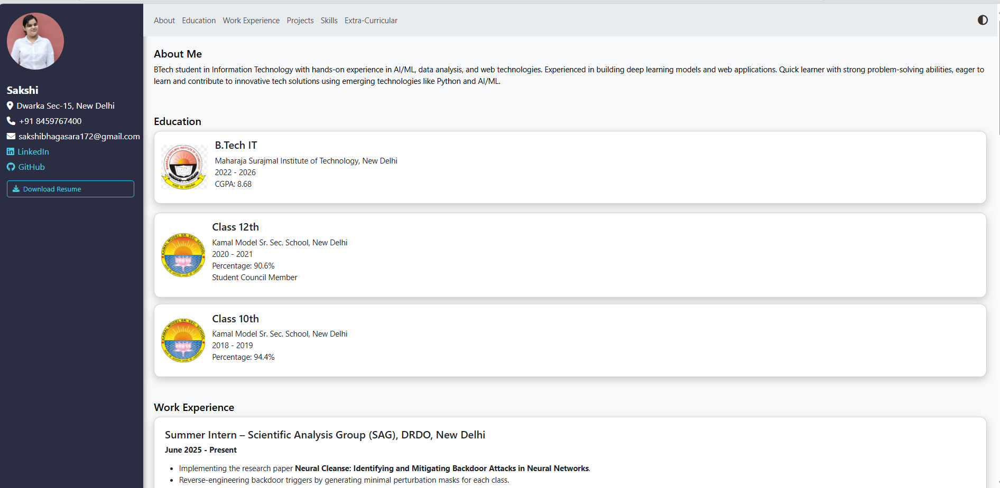
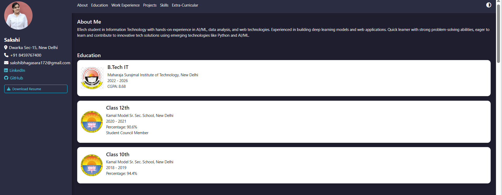
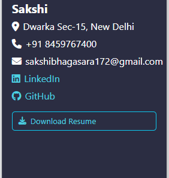

# 🌐 Personalized Portfolio Website

This project is a responsive and interactive portfolio website built using modern front-end technologies. It serves as a digital resume to highlight academic background, technical skills, project work, and professional presence through a clean and modular layout.

The website includes dynamic animations, theme toggle functionality, and integration with platforms like GitHub and LinkedIn to present a professional and engaging online identity.

---

## 🧠 Features

- 📱 **Responsive design** compatible with mobile, tablet, and desktop devices.
- 🎨 **Dark/light theme toggle** with global styling support.
- 🧩 Modular sections: **About**, **Education**, **Projects**, **Skills**, and **Extra-curriculars**.
- 🔗 External links to **GitHub**, **LinkedIn**, and downloadable **resume**.
- 🌀 Smooth scroll animations via **AOS (Animate On Scroll)** library.
- 🔧 Clean, semantic, and customizable code using **Bootstrap utility classes**.

---

## ⚙️ Tech Stack

- **Languages**: HTML5, CSS3, JavaScript  
- **Frameworks**: Bootstrap 5  
- **Libraries**: AOS (Animate On Scroll), Font Awesome  
- **Tools**: VS Code, GitHub Pages (for hosting)

---

## 📸 Screenshots

### 💻 Full Website Preview

### 🎨 Light vs Dark Theme

### 🧑‍💼 Resume Download Button

---

## 🚀 Hosting

The website is deployed using **GitHub Pages** and can be accessed here:  
[🔗 View Live Demo](https://sakshi-172.github.io/portfolio/)
